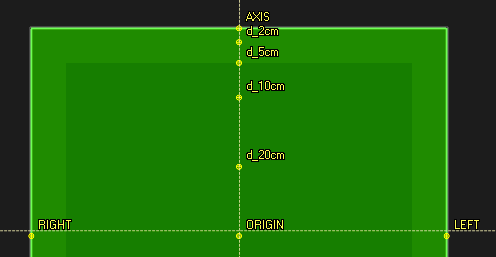
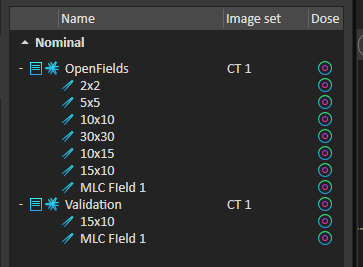
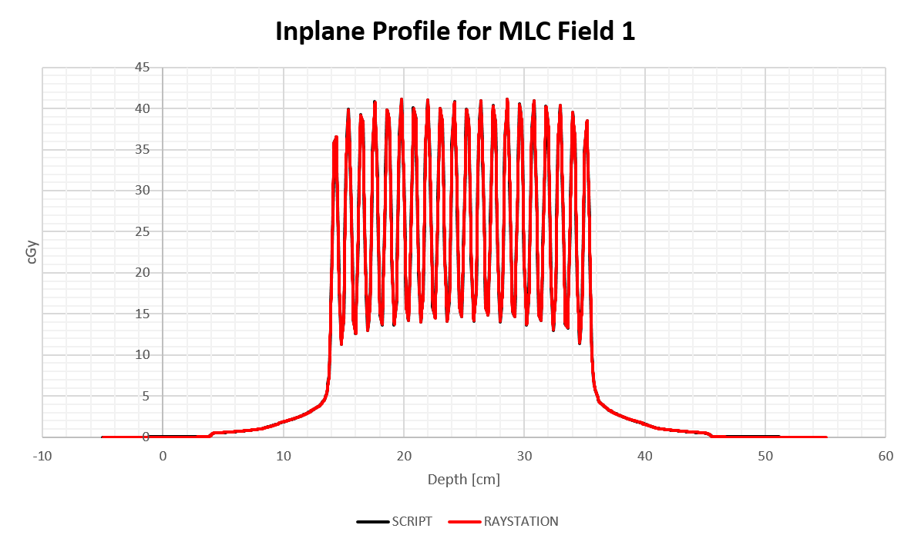
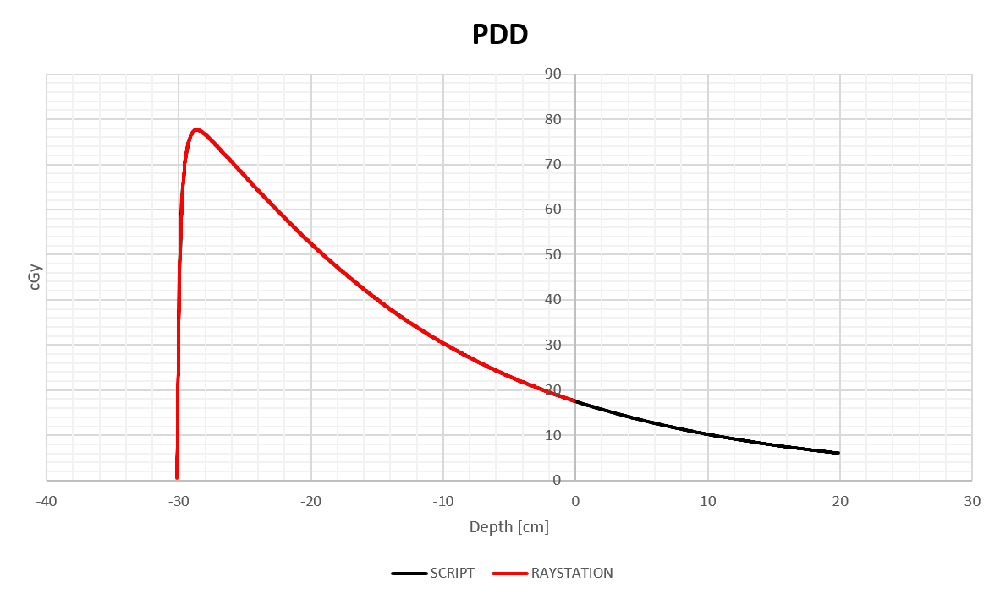

# Extracting Profiles and PDDs from RayStation 12A Phantoms 

This project contains a set of python modules that expedite the extraction of profiles and PDDs from a RayStation phantom. 

The files are exported as a *bare bones* *.mcc* file which can opened in PTW programs for further analysis. 

---
## QuickStart Guide 

The script expects RayStation to be in a certain state. 
All beams in the current BeamSet will have profiles and PDDs generated according to the following rules. 

### Directory Structure 
Copy the [phantom_curves.py](./phantom_curves.py) file into a project root directory. Also copy the [PDD.mcc](./mcc/template/PDD.mcc) and [PROFILE.mcc](./mcc/template/PROFILE.mcc) files. 

Create a directory as follows:
- mcc
    - template
        - PDD.mcc
        - PROFILE.mcc
    - raystation_data_out 
- phantom_curves.py

Exported profiles and PDDs will wind up in ./mcc/raystation_data_out/.

### POIs
POIs define the start and end of each phantom curve. 

| Curve type | POIs |
| :--- | :--- |
| Crossplane Profile | RIGHT -> LEFT |
| Inplane Profile | GUN -> TARGET | 
| AXIS | PDD |

POIs will be extracted at all depths indicated with a POI named according to *d_Xcm*. PDDs will start at AXIS and continue to a depth of 50cm. 

Capitalization in POI names is important. All must be defined for the script to work. 

**No check of RayStation's state is done before executing the script.** If these conditions are not met, the script will die silently.



Example Patient: 
RayTraining 40x40x40 Phantom, Case: LSt WaterTank Phantom, COMMISSIONING. 

## BeamSet
The current BeamSet should contain **only 3D-CRT** beams - at the time of writing, SMLC and DMLC beams are unsupported.

Final dose should be calculated. 

The Beam Name and Description are used in output .mcc file - **HINT** - use descriptive names. 

 

## Limitations 
**This is a work in progress.** 
There are some known, *and many unknown* limitations:

- The FoR for the exported profiles is that of the current image set. 
    - Profiles and PDDs may need to shifted to coincide with measured data. 
    - You can do this, for multiple curves at once, in PTW DataAnalyse.
- A simple blank *template.mcc* file is modified & saved. The resulting file will have the following limitations: 
   - Collimator and gantry at zero
   - Measured in water 
    - Energies come in as X.3 e.g 6FFF will be represented as 6.3. **TO DO**
    - Field Type will be IRREGULAR
    - Reference field: 10x10, 5cm deep, ISOCENTER 
    - SCD assumed 1000mm
    - Nominal dmax 20mm


## Validation 

The code output was validated by comparing a few script extracted profiles with the line dose tool in RayStation. More detail can be found in [this spreadsheet](./validation/validating_phantom_curves_script.xlsx).




# Developer Guide 
RayStation does most of the hard work! 

There are two convenience classes that facilitate the automatic extraction of high quality phantom curves. 

Usage then basically amounts to connecting the two objects together in a for loop though the current
BeamSet.

**Example Usage**

```
from raystation_curves import RayCurves
from ptw_mcc import PTW_mcc 

# -- CONSTANTS -- 
beam_set = get_current("BeamSet")
PROJECT_ROOT = os.getcwd() 

for beam_dose in beam_set.FractionDose.BeamDoses:
    rc = RayCurves(
        beam_dose
    )

    for y, d in zip(rc.crossplane_profiles, rc.cax_depths):
        crossplane_profile_mcc = PTW_mcc(
            rc,
            curve_type = "x profile",
            depth = d,
            energy = rc.energy,
            positions =rc.crossplane_positions,
            dose = y,
            f_root = PROJECT_ROOT
        )
        crossplane_profile_mcc.write_mcc()
```

## RayCurves 
[./rs_macros/raystation_curves.py](./rs_macros/raystation_curves.py)

## PTW_mcc 
[./mcc/ptw_mcc.py](./mcc/ptw_mcc.py) 
